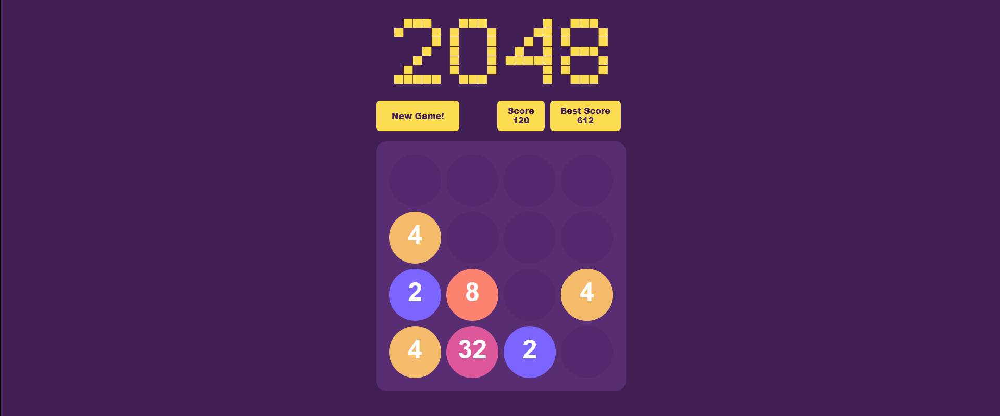

## 2048

> This project os implementation of 2048 puzzel using Reactjs

2048 is a single-player sliding block puzzle game designed by Italian web developer Gabriele Cirulli. The game's objective is to slide numbered tiles on a grid to combine them to create a tile with the number 2048. However, one can continue to play the game after reaching the goal, creating tiles with larger numbers.

Credits: Starter code [PanJiaChen](https://github.com/PanJiaChen)
